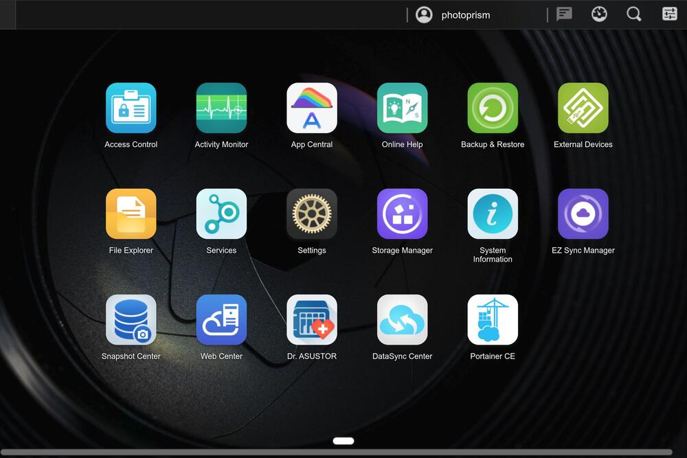
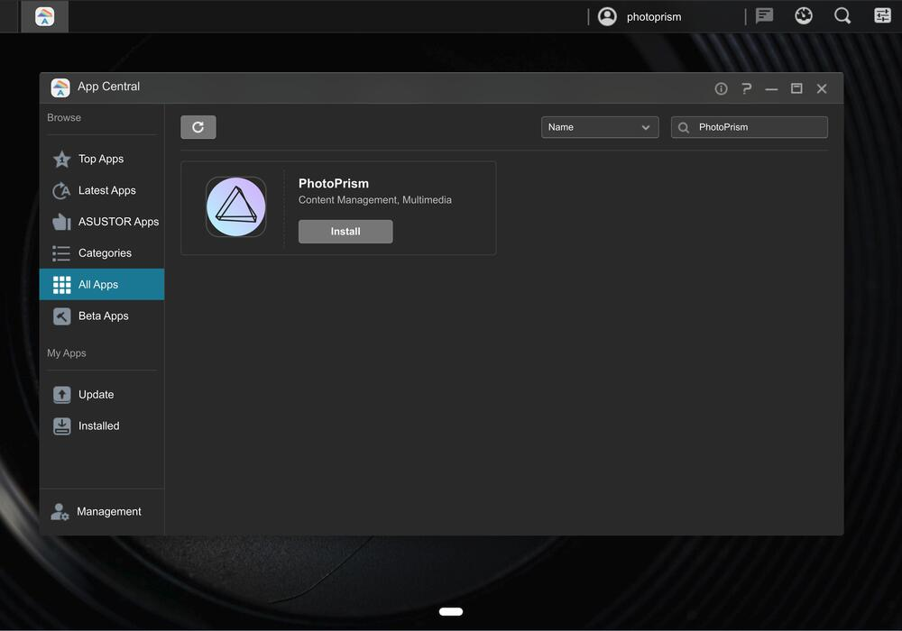
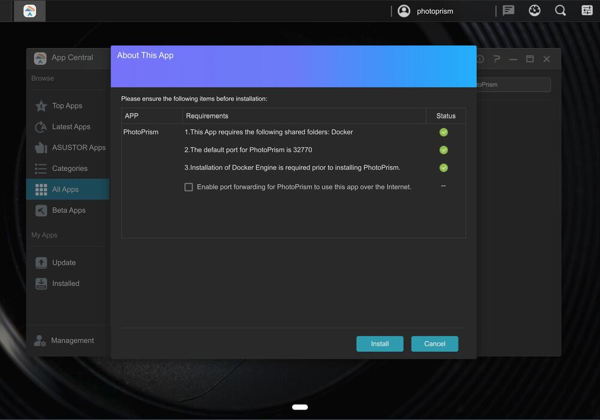
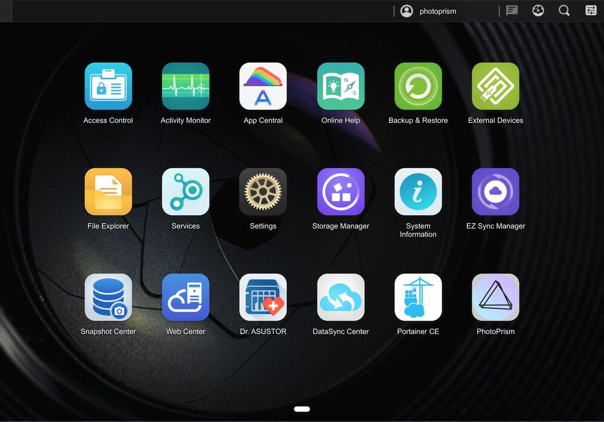
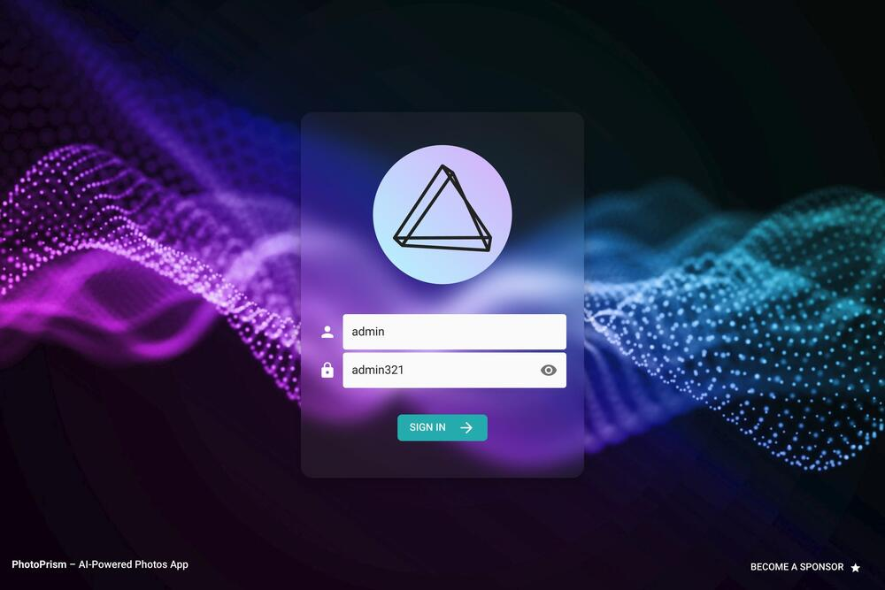
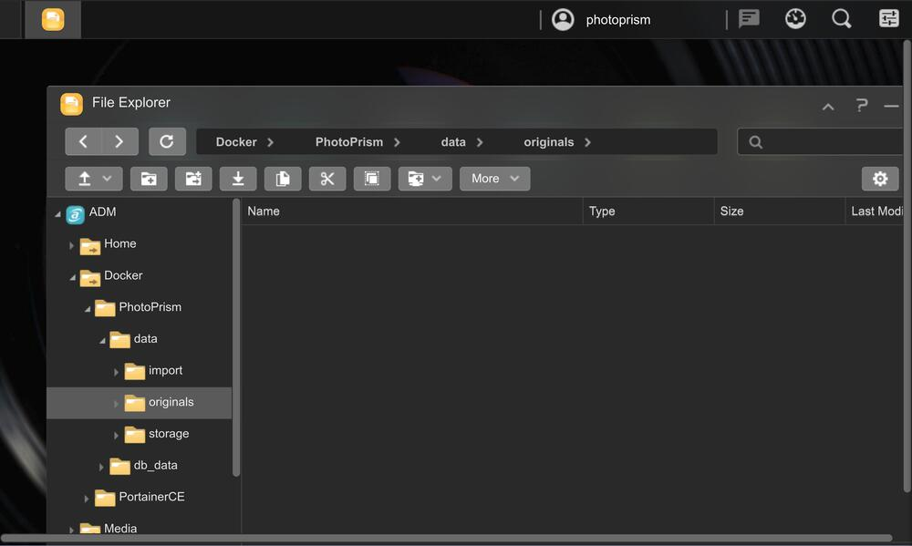

# Running PhotoPrism on an Asustor NAS

!!! danger ""
    Please note that third-party apps may not provide access to the docker-compose.yml file or the command line, and therefore you may not be able to use all of PhotoPrism's features and config options.

Before setting up PhotoPrism on your NAS, we recommend that you check the [Asustor product database](https://www.asustor.com/en/product/product_list) for the CPU and memory configuration of your device.

For a good user experience, it should be a 64-bit system with [at least 2 cores and 3 GB of RAM](../index.md#system-requirements). Indexing large photo and video collections also benefits greatly from [using SSD storage](../troubleshooting/performance.md#storage), especially for the database and cache files.

!!! tldr ""
    Note that [RAW image conversion and TensorFlow are disabled](../../user-guide/settings/advanced.md) on devices with 1 GB or less memory, and that high-resolution panoramic images may require [additional swap space](../troubleshooting/docker.md#adding-swap) and/or physical memory above the recommended minimum. We take no responsibility for [instability or performance problems](../troubleshooting/performance.md) if your device does not [meet the requirements](../index.md#system-requirements).

## Setup

This step-by-step guide explains how to set up a new PhotoPrism instance through App Central, the built-in app store.

### Step 1: Open App Central

Log in to the user interface of your NAS. You can do this by navigating to *https://asustor:7001* if you replace *asustor* with the actual IP address or hostname of your device and change the port depending on your configuration.

Now open "App Central" on the home screen:

{ class="shadow" }

### Step 2: Install PhotoPrism

Type *PhotoPrism* in the search box in the upper right corner and press Enter to start the search. PhotoPrism should then be displayed so you can click "Install" to start the installation:

{ class="shadow" }

Next, you will be informed about dependencies like Docker that need to be installed, and you can decide whether you want your instance to be accessible from the Internet (if you have set this up for your NAS and your Internet router is compatible):

{ class="shadow" }

If you want to [uninstall PhotoPrism](img/asustor/asustor-step-3.jpg) later, you can also do that in App Central.

### Step 3: Open PhotoPrism

Once the installation is complete, you will find PhotoPrism on your home screen, where you can open it in a new tab with one click:

{ class="shadow" }

You can also navigate to port 32770 on your device if you want to open PhotoPrism directly.
When you see the login screen, enter the username "admin" and password "admin321" to sign in:

{ class="shadow" }

Remember to change your password after the first login. You can do this in [Settings > Account](../../user-guide/settings/account.md#change-password).

### Step 4: Add Your Files

Our [First Steps 👣](../../user-guide/first-steps.md) tutorial guides you through the user interface and settings to ensure your library is indexed according to your individual preferences.

Depending on which strategy you choose, you can add your media files to the *originals* or *import* folder located in */volume1/Docker/PhotoPrism/data*:

{ class="shadow" }

The *storage* folder, which contains configuration, cache and sidecar files, can also be found there.

!!! tldr ""
    Note that the folders that PhotoPrism uses cannot be dynamically configured at the moment when using this app store version. However, we are working to make this possible.
