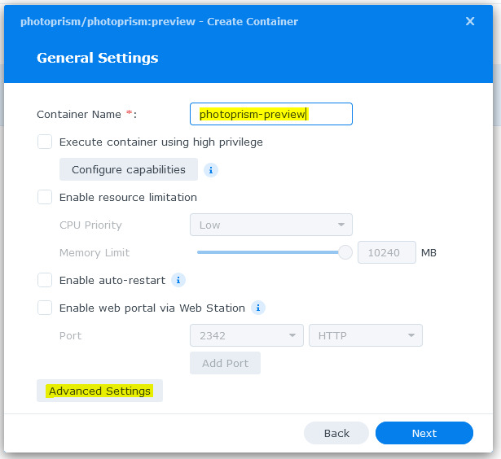
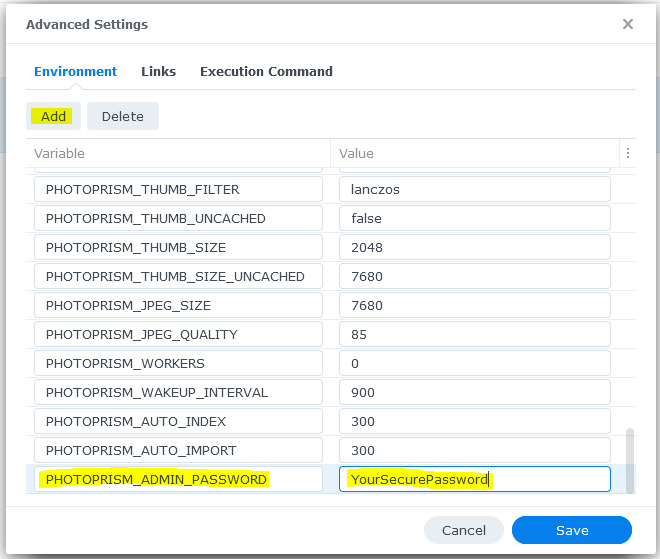
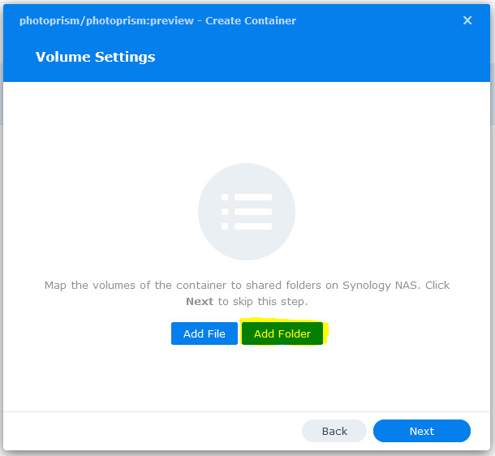
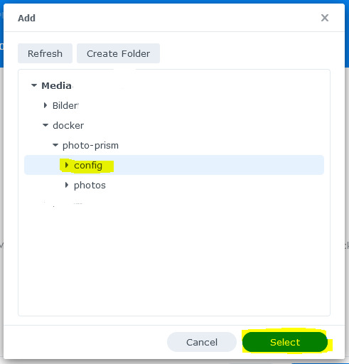

# Running PhotoPrism on a Synology NAS

Before setting up PhotoPrism on your NAS, we recommend that you visit the [Synology Knowledge Base](https://kb.synology.com/en-us/DSM/tutorial/What_kind_of_CPU_does_my_NAS_have) to learn about the CPU and memory configuration of your device:

- for a good user experience, a 64-bit system with at least [2 cores and 3 GB of physical memory](../index.md#system-requirements) is recommended
- indexing large photo and video collections also benefits greatly from [using SSD storage](../troubleshooting/performance.md#storage), especially for the database and cache files 

!!! tldr ""
    Should you experience problems with the installation, we recommend that you ask the Synology community for advice, as we cannot provide support for third-party software and services.
    Also note that [RAW image conversion and TensorFlow are disabled](../../user-guide/settings/advanced.md) on devices with 1 GB or less memory, and that high-resolution panoramic images may require [additional swap space](../troubleshooting/docker.md#adding-swap) and/or physical memory above the recommended minimum.

### Will my device be fast enough?

This largely depends on your expectations and the number of files you have. Most users report that PhotoPrism runs
well on their Synology NAS. However, you should keep in mind:

- initial indexing may take longer than on standard desktop computers
- the hardware has no video transcoding support and software transcoding is generally slow

## Troubleshooting ##

If your device runs out of memory, the index is frequently locked, or other system resources are running low:

- [ ] Try [reducing the number of workers](../config-options.md#index-workers) by setting `PHOTOPRISM_WORKERS` to a reasonably small value in `docker-compose.yml`, depending on the performance of your device
- [ ] Make sure [your device has at least 4 GB of swap space](../troubleshooting/docker.md#adding-swap) so that indexing doesn't cause restarts when memory usage spikes; RAW image conversion and video transcoding are especially demanding
- [ ] If you are using SQLite, switch to MariaDB, which is [better optimized for high concurrency](../faq.md#should-i-use-sqlite-mariadb-or-mysql)
- [ ] As a last measure, you can [disable the use of TensorFlow](../config-options.md#feature-flags) for image classification and facial recognition

Other issues? Our [troubleshooting checklists](../troubleshooting/index.md) help you quickly diagnose and solve them.


## Setup using Docker & SQLite ##

!!! attention ""
    Note that [SQLite is generally not a good choice](../troubleshooting/sqlite.md) for users who require scalability and high performance.

    Since we don't have a Synology test device, contributions to a step-by-step tutorial using mariadb are greatly appreciated.
    You can contribute by clicking :material-pencil: to send a pull request with your changes.

!!! example ""
    **Help improve these docs!** You can contribute by clicking :material-pencil: to send a pull request with your changes.

This guide describes how to set up PhotoPrism using the new Synology user interface.

### Prerequisites
- Docker is installed
- folders config and photos are created:

  { class="shadow" }

- for testing purposes, add some pictures to your photos folder
- later, if you're ok with your setup, you can link your pictures to the photos folder

### Get the image
- Launch Docker
- Search for photoprism/photoprism in the Registry
- Download and choose your flavor
- Wait until you get the message your image is downloaded. It is big, so this can take a while

### Set PhotoPrism up
- double-click the image you just downloaded
- Network: choose your network - next
- give your container a name and click on Advanced Settings

  { class="shadow" }

- Add Variable PHOTOPRISM_ADMIN_PASSWORD with your password

  { class="shadow" }

- enter values for PHOTPRISM_SITE_DESCRIPTION and PHOTOPRISM_SITE_AUTOR
- PHOTOPRISM_DATABASE_SERVER and PHOTOPRISM_DATABASE_PASSWORD are used for mariadb. It is recommended to use mariadb but not part of this guide
- Save

  { class="shadow" }

- Next
- enter the local port you want to use to connect to PhotoPrism

  { class="shadow" }

- in the Volume Settings we're adding the two folders (see prerequisites)
- choose config, add /photoprism/storage as Mount path
- choose photos, add /photoprism/originals as Mount path

  { class="shadow" }
  { class="shadow" }
  { class="shadow" }

- Done
- Run the container and give it some minutes to create
- connect to your instance of Photoprism with your browser ip-to-your-nas:port and login

### First Steps

Our [First Steps 👣](../../user-guide/first-steps.md) tutorial guides you through the user interface and settings to ensure your library is indexed according to your individual preferences.


<!---

## Setup using Portainer ##

!!! missing ""
    This community-maintained guide is currently out of date. Updating it to work with the latest Portainer 
    version is a great way to contribute! 🌷

    Click the [edit link](https://github.com/photoprism/photoprism-docs/tree/master/docs/getting-started/nas/synology.md)
    to perform changes and send a pull request.

This guide will help you install PhotoPrism in your Synology NAS using [Portainer](https://www.portainer.io/),
an open-source container manager system. The guide will cover the following steps:

- install Portainer in your Synology NAS using Task Manager;
- configure Portainer to use your Synology's docker endpoint;
- install PhotoPrism in your Synology NAS using Portainer, accessible over http / direct IP;
- (TO-DO) configure a reverse proxy in your Synology NAS to access PhotoPrism over https / custom domain name.

#### Step 1: Install Portainer in your Synology NAS using Task Manager ####

Synology's official docker app is quite limited in terms of functionality and that is the reason why we will install Portainer first. It will make managing docker containers inside Synology much more easier and functional while sharing the same local docker endpoint (i.e. the same docker images / containers / volumes / etc. will be manageable in both Synology's app and Portainer). We could install it using the terminal / SSH connection to the NAS but in this way everything can be done using Synology's Diskstation Manager UI.

To install Portainer:

1. install Synology's Docker app from the official package center;
2. open Synology's File Station app and browse to the newly created _docker_ shared folder;
3. create a folder named _portainer_ inside _docker_, which will persist relevant Portainer's data in our local filesystem.
4. open Synology's Control Panel > Task Scheduler and create a new Scheduled Task > User-defined script; you'll then need to fill in some details in the _General_, _Schedule_ and _Task Settings_ sections.

    4.1. in _General_ fill in:
    
      4.1.1. Task: use a meaningful name, for e.g. _Install Portainer_;
      
      4.1.2. User: keep this as _root_.

    4.2. in _Schedule_ fill in:
    
      4.2.1. Date: set the task to run on a specific date (for eg. today) and choose _Do not repeat_. This task will be used just once to install Portainer, we don't want to run it afterwards;
      
      4.2.2. Time: leave the default settings, they have no relevance;

    4.3. in _Task Settings_ fill in:
    
      4.3.1. Run command: copy/paste the user defined script below. Check if the ports are available on your NAS and that the path to the volume is correct (it should point to the folder created in step 3 above):
      ```
      docker run -d -p 8000:8000 -p 9000:9000 --name=portainer --restart=always -v /var/run/docker.sock:/var/run/docker.sock -v /volume1/docker/portainer:/data portainer/portainer-ce
      ```
      
5. click _OK_; then, on the list of scheduled tasks, select the newly created task and hit _Run_; follow the prompts to install Portainer; in the end you can delete the task or keep it – just uncheck the _enabled_ checkbox to disable the task.

6. Portainer should now be acessible in your local network in http://[YOUR-LOCAL-IP]:9000/.

#### Step 2: Configure Portainer to use your Synology's docker endpoint ####

7. Open Portainer by visiting http://[YOUR-LOCAL-IP]:9000/;
8. Choose and confirm a strong password; you will manage Portainer using this password and the _admin_ username;
9. Select _Docker - Manage the local Docker environment_ to link Portainer to your Synology's local docker endpoint and hit _Connect_; Portainer's admin page should open;
10. Click _Environment_ in the left menu, then _local_ and under _Public IP_ place your local NAS IP (it should be the same [YOUR-LOCAL-IP] of step 6.

#### Step 3: Install PhotoPrism in your Synology NAS using Portainer, accessible over http / direct IP ####

With Portainer installed we can use a docker-compose.yml file to deploy a stack composed by PhotoPrism and MariaDB to quickly get PhotoPrism running in our NAS. We can use [PhotoPrism's default docker compose yml file](https://dl.photoprism.app/docker/docker-compose.yml).

11. open Synology's File Station app and browse to the _docker_ shared folder;
12. create a folder named _photoprism_ inside _docker_, which will persist relevant Photoprism's data in our local filesystem;
13. inside _photoprism_ folder, create three more folders: _storage_, _originals_ and _database_.
14. Open Portainer by visiting http://[YOUR-LOCAL-IP]:9000/;
15. Click _Stacks_ in the left menu, then _Add stack_, give it a meaningful name (for eg. Photoprism) and in the Web Editor place the content of [PhotoPrism's default docker compose yml file](https://dl.photoprism.app/docker/docker-compose.yml).

**BE SURE TO USE YOUR OWN PHOTOPRISM_ADMIN_PASSWORD, PHOTOPRISM_DATABASE_PASSWORD, MYSQL_ROOT_PASSWORD, AND MYSQL_PASSWORD BY CHANGING THE VALUES ACCORDINGLY, AND CHECK THE LOCAL VOLUMES PATHS TO MATCH THOSE DEFINED IN STEP 13**.

16. Click _Deploy the stack_. Give it a few minutes and PhotoPrism should be accessible in http://[YOUR-LOCAL-IP]:[LOCAL-PORT]/.

!!! info
    Synology automatically creates thumbnail files inside a special `@eaDir` folder when uploading 
    media files such as images.
    PhotoPrism now ignores folders starting with `@` so that you don't need to manually exclude
    them in a `.ppignore` file anymore.

#### Step 4: Configure a reverse proxy in your Synology NAS to access PhotoPrism over https / custom domain name ####

Synology allows you to configure a nginx reverse proxy to serve your applications over HTTPS. Configurations can be made in Diskstation manager _Control Panel_, _Application Portal_, _Reverse proxy_.:
Click create. [Description] give it a meaningful name (for eg. PhotoPrism) [Protocol]=HTTPS [Hostname]=[YOUR-HOSTNAME] [Port]=[YOUR-PORT] (for eg. 2343) check Enable HSTS and HTTP/2 . under Destination [Protocol]=HTTP [Hostname]=[YOUR-LOCAL-IP][PORT]=[YOUR-PORT] (default is 2342)
Last step under _Custom Header_.:
Click create [Websocket] and hit OK (this step makes that your browser receive photo counts, log messages, or metadata updates).

**IMPORTANT: make sure that you have forwarded the selected port (for eg. 2343) in your router:**

-->