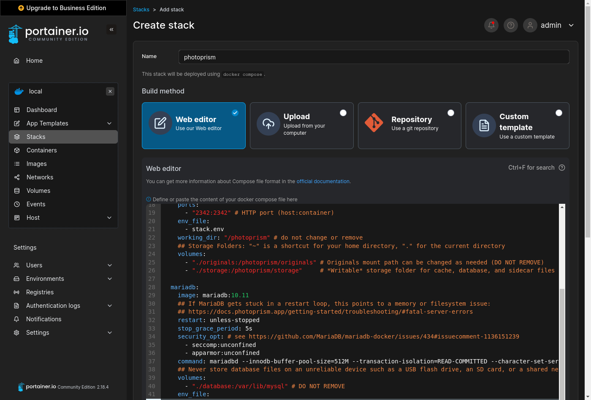
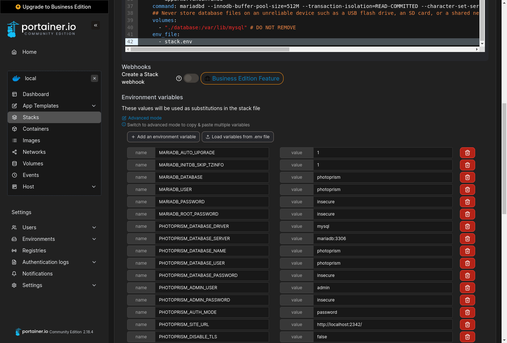
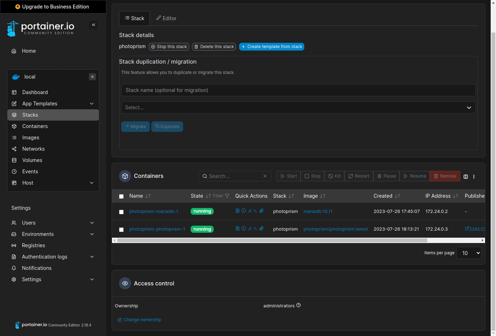

# Portainer Setup Guide

[Portainer](https://www.portainer.io/) can be used to manage Docker containers through a web interface. On many [NAS devices](../nas/synology.md), it either comes pre-installed or you can simply install it from the vendor's app store. If you are installing PhotoPrism on a regular home or cloud server, you may instead want to follow our [Docker Compose Setup Guide](../docker-compose.md), which only uses standard Docker tools and commands.

### Step 1: Create Stack ###

Navigate to "Stacks", click "Add stack" and paste the [contents of our *stack.yml* config template](https://dl.photoprism.app/docker/portainer/stack.yml){:target="_blank"} (opens in a new tab) into the *Web editor* so that you can change the storage folder locations in the `volumes:` sections as needed:

{ class="shadow" }

When using the *Web editor*, please note that related values must start at the same indentation level [in YAML files](../../developer-guide/technologies/yaml.md) and that tabs are not allowed for indentation. We recommend using 2 spaces.

!!! tldr ""
    Which path names you need to configure for the *originals*, *storage*, and *database* volumes depends on your NAS device and its configuration. The following section describes them in detail.

#### MariaDB ####

Our [stack template](https://dl.photoprism.app/docker/portainer/stack.yml){:target="_blank"} includes a pre-configured [MariaDB](https://mariadb.com/) database server. We recommend [using SSD storage](../troubleshooting/performance.md#storage) for it, if available. Also note that [database files should never be stored on an unreliable device](../troubleshooting/mariadb.md#corrupted-files) such as a USB flash drive, SD card, or shared network folder.

!!! tldr ""
    It is not possible to change the password via `MARIADB_PASSWORD` after the database has been started 
    for the first time. Choosing a secure password is not essential if you don't [expose the database to other apps and hosts](../troubleshooting/mariadb.md#cannot-connect).
    To enable [automatic schema updates](../troubleshooting/mariadb.md#auto-upgrade) after upgrading to a new major version, set `MARIADB_AUTO_UPGRADE` to a non-empty value.

#### Volumes ####

Since the app is running inside a container, you have to explicitly [mount the folders](https://docs.docker.com/compose/compose-file/compose-file-v3/#volumes) on your device that you want to use.
PhotoPrism won't be able to see folders that have not been mounted. That's an important security feature.

##### /photoprism/originals #####

The *originals* folder contains your original photo and video files:

```yaml
volumes:
  # "/nas/path:/container/path"
  - "./originals:/photoprism/originals"
```

We recommend that you change `./originals` to the path on your NAS that contains your existing media files. If you keep the default path, it will be located in the internal application folder that Portainer creates automatically.

You can mount [any folder accessible from your NAS](https://docs.docker.com/compose/compose-file/compose-file-v3/#short-syntax-3), including [network shares](../troubleshooting/docker.md#network-storage). Additional directories can also be mounted as subfolders of `/photoprism/originals` (depending on [overlay file system support](../troubleshooting/docker.md#overlay-volumes)):

```yaml
volumes:
  - "/home/username/Pictures:/photoprism/originals"
  - "/example/friends:/photoprism/originals/friends"
  - "/mnt/photos:/photoprism/originals/media"
```

!!! tldr ""
    If *read-only mode* is enabled, all features that require write permission to the *originals* folder 
    are disabled, e.g. [WebDAV](../../user-guide/sync/webdav.md), uploading and deleting files. 

##### /photoprism/storage #####

The *storage* folder is used to save config, cache, thumbnail and sidecar files:

- a *storage* folder mount (with write access) must always be specified so that you do not lose these files after a restart or upgrade
- never configure the *storage* folder to be inside the *originals* folder unless the name starts with a `.` to indicate that it is hidden
- we recommend placing the *storage* folder on a [local SSD drive](../troubleshooting/performance.md#storage) for best performance
- mounting [symbolic links](https://en.wikipedia.org/wiki/Symbolic_link) or using them inside the *storage* folder is currently not supported

```yaml
volumes:
  - "./storage:/photoprism/storage"
```

!!! tldr ""
    Should you later want to move your instance to another NAS, the easiest and most time-saving way is to copy the entire *storage* folder along with your originals and database.

##### /photoprism/import #####

You can optionally mount an *import* folder from which files can be transferred to the *originals* folder
in a structured way that avoids duplicates:

- [imported files](../../user-guide/library/import.md) receive a canonical filename and will be organized by year and month
- never configure the *import* folder to be inside the *originals* folder, as this will cause a loop by importing already indexed files

!!! tldr ""
    You can safely skip this. Adding files via [Web Upload](../../user-guide/library/upload.md)
    and [WebDAV](../../user-guide/sync/webdav.md) remains possible, unless [read-only mode](../config-options.md)
    is enabled or the [features have been disabled](../../user-guide/settings/general.md).

### Step 2: Finalize Setup ###

To complete the setup, [download the *stack.env* file from our server](https://dl.photoprism.app/docker/portainer/stack.env) (right click and *Save Link As...*), click "Load variables from .env file", upload it to Portainer, and then [change the values according to your needs](../config-options.md):

{ class="shadow" }

!!! danger ""
    Always change `PHOTOPRISM_ADMIN_PASSWORD` so that the app starts with a **secure initial password**.
    Never use easy-to-guess passwords or default values like `insecure` on publicly accessible servers.
    There is no default in case no password was provided. A minimum length of 8 characters is required.

When you're done, scroll down and click "Deploy the stack" without changing any of the other options:

{ class="shadow" }

After waiting a few moments, you should be able to log in to the web interface by navigating to <http://localhost:2342/>.

!!! tldr ""
    If you have modified the server host, port, or protocol in your configuration, the URL to use will change accordingly.

### Step 3: Index Your Library ###

Our [First Steps 👣](../../user-guide/first-steps.md) tutorial guides you through the user interface and settings to ensure your library is indexed according to your individual preferences.

!!! tldr ""
    The config options and container image you want to use can be changed at any time by navigating to "Stacks", selecting your existing PhotoPrism stack, clicking "Editor", updating the [configuration to your needs](../config-options.md), and then clicking "Update the stack" to apply the changes.

### PhotoPrism® Plus ###

Our members can activate [additional features](https://link.photoprism.app/membership) by logging in with the [admin user created during setup](../config-options.md#authentication) and then following the steps [described in our activation guide](https://www.photoprism.app/kb/activation). Thank you for your support, which has been and continues to be essential to the success of the project! :octicons-heart-fill-24:{ .heart .purple }

[Compare Memberships ›](https://link.photoprism.app/membership){ class="pr-3 block-xs" } [View Membership FAQ ›](https://www.photoprism.app/membership/faq) 

!!! example ""
    We recommend that new users install our free Community Edition before [signing up for a membership](https://link.photoprism.app/membership).

### Troubleshooting ###

If your server runs out of memory, the index is frequently locked, or other system resources are running low:

- [ ] Try [reducing the number of workers](../config-options.md#index-workers) by setting `PHOTOPRISM_WORKERS` to a reasonably small value, depending on the CPU performance and number of cores
- [ ] Make sure [your server has at least 4 GB of swap space](../troubleshooting/docker.md#adding-swap) so that indexing doesn't cause restarts when memory usage spikes; RAW image conversion and video transcoding are especially demanding
- [ ] If you are using SQLite, switch to MariaDB, which is [better optimized for high concurrency](../faq.md#should-i-use-sqlite-mariadb-or-mysql)
- [ ] As a last measure, you can [disable the use of TensorFlow](../config-options.md#feature-flags) for image classification and facial recognition

Other issues? Our [troubleshooting checklists](../troubleshooting/index.md) help you quickly diagnose and solve them.

!!! info ""
    You are welcome to ask for help in our [community chat](https://link.photoprism.app/chat).
    [Sponsors](https://www.photoprism.app/membership) receive direct [technical support](https://www.photoprism.app/contact) via email.
    Before [submitting a support request](../index.md#getting-support), try to [determine the cause of your problem](../troubleshooting/index.md).

### Command-Line Interface ###

#### Opening a Terminal

Navigate to "Stacks", select the PhotoPrism stack and scroll down to the list of containers:

{ class="shadow" }

Now click the :fontawesome-solid-terminal: button belonging to the *photoprism-photoprism-1* container and [accept the default settings](console-settings.png) to open a terminal:

{ class="shadow" }

Running `photoprism help` lists all commands and [options](../config-options.md) available in the current version:

```bash
photoprism help
```

Use the `--help` flag to see a detailed command description, for example:

```bash
photoprism backup --help
```

The command-line interface is also well suited for job automation using a [scheduler](https://dl.photoprism.app/docker/scheduler/).

#### Examples

| Action                                                       | Command                        |
|--------------------------------------------------------------|--------------------------------|
| *Display Config Values*                                      | `photoprism show config`       |
| *Show Migration Status*                                      | `photoprism migrations ls`     |
| *Repeat Failed Migrations*                                   | `photoprism migrations run -f` |
| *Reset Database*                                             | `photoprism reset -y`          |
| *Backup Database*                                            | `photoprism backup -a -i`      |                      
| *Restore Database*                                           | `photoprism restore -a -i`     |                   
| *Change Admin Password*                                      | `photoprism passwd [username]` |
| *Show User Management Commands*                              | `photoprism users help`        |
| *Reset Users*                                                | `photoprism users reset -y`    |
| *Show Face Recognition Commands*                             | `photoprism faces help`        |
| *Index Faces*                                                | `photoprism faces index`       |
| *Reset People & Faces*                                       | `photoprism faces reset -f`    |
| *Transcode Videos to AVC*                                    | `photoprism convert`           |
| *Regenerate Thumbnails*                                      | `photoprism thumbs -f`         |
| [*Update Index*](../../user-guide/library/originals.md)   | `photoprism index --cleanup`   |                  
| [*Move to Originals*](../../user-guide/library/import.md) | `photoprism import [path]`     |                  
| [*Copy to Originals*](../../user-guide/library/import.md) | `photoprism cp [path]`         |                  

*[home directory]: /home/username on Linux and many NAS devices
*[host]: Computer, Cloud Server, or VM that runs PhotoPrism
*[swap]: substitute for physical memory
*[HEIF]: High Efficiency Image File Format
*[RAW]: image format that contains unprocessed sensor data
*[SSD]: Solid-State Drive
*[CDN]: Content Delivery Network
*[UI]: User Interface
*[CLI]: Command-Line Interface
*[AVC]: MPEG-4 / H.264
*[FFmpeg]: transcodes video files
*[SQLite]: self-contained, serverless SQL database
*[read-only]: write protected
*[filesystem]: contains your files and folders
