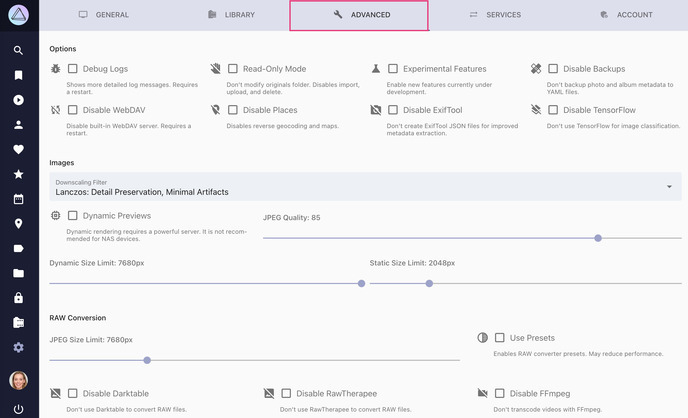
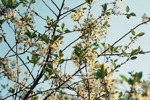

# Advanced Settings #

System [config options](../../getting-started/config-options.md) such as the image quality can be changed 
on the advanced settings page. You can also disable specific features and enable the debug or read-only mode.

!!! tldr ""
    Since they are not safe to use without authentication, these settings are not available when running in [public mode](../../getting-started/config-options.md#authentication). Changing [config options](../../getting-started/config-options.md) is still possible via configuration files and with command parameters.

!!! note ""
    Changing advanced settings always **requires a restart** to take effect. Selecting a different thumbnail
    quality or size won't replace existing thumbnails. You can regenerate them using the 
    [command-line interface](https://docs.photoprism.app/getting-started/docker-compose/#command-line-interface).

{ class="shadow" }

All [config options](../../getting-started/config-options.md) can be set in your `docker-compose.yml` or
via command-line parameters as well. Manually changed values are saved in a config file. It is stored in
the `storage/config` folder by default.

## Options

### Debug Logs
When enabled, debug logs are shown in *Library>Logs*.
Requires restart.

The corresponding [config toggle](../../getting-started/config-options.md) is `PHOTOPRISM_DEBUG`.

### Read-only Mode
When enabled, importing, uploading and deleting files is not possible.

The corresponding [config toggle](../../getting-started/config-options.md) is `PHOTOPRISM_READONLY`.

### Experimental Features
When enabled, your instance will be updated with experimental features.

The corresponding [config toggle](../../getting-started/config-options.md) is `PHOTOPRISM_EXPERIMENTAL`.

### Disable Backups
This option prevents creating the following `yml` backups:

- For photos in `storage/sidecar`
- For albums, months, states and folders in `storage/albums`

The corresponding [config toggle](../../getting-started/config-options.md) is `PHOTOPRISM_DISABLE_BACKUPS`.

### Disable WebDAV
This option prevents building WebDav connections.
Requires restart for changes to be applied.

The corresponding [config toggle](../../getting-started/config-options.md) is `PHOTOPRISM_DISABLE_WEBDAV`.

### Disable Places
When selected, geo-information (latitude, longitude) will still be read (and indexed)
from your files metadata, however PhotoPrism will not use reverse lookup to
determine place names using those coordinates as it normally would.

The Places section will not be visible.

The corresponding [config toggle](../../getting-started/config-options.md) is `PHOTOPRISM_DISABLE_PLACES`.

### Disable ExifTool
This option prevents the creation of `json` files with Exif data in `storage/sidecar`.
Note that you must have Exiftool enabled to extract video metadata such as duration, resolution, and codec.

The corresponding [config toggle](../../getting-started/config-options.md) is `PHOTOPRISM_DISABLE_EXIFTOOL`.

### Disable TensorFlow
When selected, image classification / object detection
(using [TensorFlow](https://www.tensorflow.org/)) is disabled,
so no labels are created for your files.

The corresponding [config toggle](../../getting-started/config-options.md) is `PHOTOPRISM_DISABLE_TENSORFLOW`.

## Images

This section controls how JPEG preview and thumbnail images are rendered. These are high-quality, scaled-down versions of your originals.

[Thumbnails are necessary](../../getting-started/faq.md#why-is-my-storage-folder-so-large-what-is-in-it) because web browsers are bad at resizing large images to fit the screen. Using full-resolution originals for slideshows and in search results would also consume a lot of browser memory and significantly reduce indexing performance.

### Downscaling Filter

This lets you select the algorithm used to resize your original images when creating thumbnails.
A detailed description of the available filters can be found in the [section below](#downscaling-filters).

For a good trade-off between quality and performance, we recommend choosing the *lanczos* filter. It may be a little slower in creating thumbnails, but produces very high quality images. In comparison, the less sophisticated *cubic* filter may be 30% faster.

The corresponding [config option](../../getting-started/config-options.md) is `PHOTOPRISM_THUMB_FILTER`.

### Dynamic Previews

Enable generating thumbnails on-the-fly as they're required
(either for viewing or analysing with TensorFlow).
This saves disk space, but is more processor-intensive and so not recommended
when hosting on less powerful devices (such as Raspberry Pi).

The corresponding [config toggle](../../getting-started/config-options.md) is `PHOTOPRISM_THUMB_UNCACHED`.

### JPEG Quality

Choose a value above 90 to display your images in the best possible quality. Note that higher values 
require more space in the *storage* folder for less compressed thumbnail files, which may also take longer to create.

Lower quality thumbnails, on the other hand, are smaller, load faster on slow Internet connections, 
and require less space in the *storage* folder and in the browser cache.

- Quality levels of 90% or higher are generally considered *high quality*
- 80% to 90% is considered *medium quality*
- 70% to 80% is considered *low quality*, as you might see with highly compressed content on social media 
 
Anything below 70% is generally of [very low quality](https://fotoforensics.com/tutorial-estq.php).

Example: If a quality of 95 results in a thumbnail file size of 500kB, then reducing the quality 
to 80 reduces the file size to about 100kB.

The corresponding [config option](../../getting-started/config-options.md) is `PHOTOPRISM_JPEG_QUALITY`.

!!! tldr ""
    **The actual impression depends on how much information an image contains.** Empty areas and skies,
    for example, are easier to compress. Images with a lot of details suffer the most.
    For this reason, reducing the quality of thumbnails also negatively impacts [face recognition](../organize/people.md)
    and image classification results. Simply put, this means that the indexer sees fewer details.

### Dynamic and Static Size Limits

**Dynamic Size Limit**: During dynamic (on-demand) thumbnail generation,
no thumbnails will be created above this size.
The corresponding [config option](../../getting-started/config-options.md) is `PHOTOPRISM_THUMB_SIZE_UNCACHED`.

**Static Size Limit**: During initial indexing or import (as thumbnails are generated),
no thumbnails will be created above this size.
The corresponding [config option](../../getting-started/config-options.md) is `PHOTOPRISM_THUMB_SIZE`.

!!! danger ""
    Reducing the *Static Size Limit* of thumbnails has a **significant impact on [face recognition](../organize/people.md) 
    and image classification** results. Simply put, it means that the indexer can no longer see properly.

!!! warning ""
    If the configured size limit is exceeded (for example, if users have a larger screen), a sufficiently large 
    thumbnail can't be created, and the photo viewer may be forced to display the original image instead.
    **Downscaling images in browsers typically results in poor quality, and they may also be displayed in 
    the wrong orientation.**

The smallest configurable size is 720px for consumption by the indexer to perform color detection, face detection, 
and image classification. Recreating them every time they are needed is too demanding for even the most powerful 
servers. Unless you only have a few small images, it would render the app unusable.

It is recommended that you set these limits high so that browsing pictures is as smooth as possible.
However, if the amount of disk storage required is a serious problem, and you are
willing to increase server load instead, it is possible to set the
*Static Size Limit* to the minimum of 720px in combination with a higher *Dynamic Size Limit*.
This allows the server to generate larger thumbnails on demand. It may also result in a noticeable delay 
when viewing pictures in full-screen mode.

!!! tip ""
    To view original images, enable *Dynamic Previews*,
    and configure *Dynamic Size Limit* and *Static Size Limit*
    to a small value like `720`. When viewing images exceeding that limit,
    the original files will be displayed.

#### What files will be created by PhotoPrism?

The minimum size for static previews is 720px, so all images up to `720x720` will be rendered.
Higher static limits will additionally generate previews only up to the defined limit.

The files are generated in the `storage/cache/thumbnails` folder,
with file paths dependent on the size and original file's hash, such as:

`storage/cache/thumbnails/1/a/3/1a30c1f...9_100x100_center.jpg`

The table below shows each generated size, with the PhotoPrism features using each.

| Name      | Width | Height | Use                      |
|:----------|:-----:|:------:|:-------------------------|
| colors    |   3   |   3    | Color Detection          |
| tile_50   |  50   |   50   | List Preview             |
| tile_100  |  100  |  100   | Maps Preview             |
| tile_224  |  224  |  224   | Mosaic Preview           |
| left_224  |  224  |  224   | TensorFlow               |
| right_224 |  224  |  224   | TensorFlow               |
| tile_500  |  500  |  500   | Cards Preview            |
| fit_720   |  720  |  720   | Mobile, TV               |
| fit_1280  | 1280  |  1024  | Mobile, HD Ready TV      |
| fit_1920  | 1920  |  1200  | Mobile, Full HD TV       |
| fit_2048  | 2048  |  2048  | Tablets, Cinema 2K       |
| fit_2560  | 2560  |  1600  | Quad HD, Retina Display  |
| fit_3840  | 3840  |  2400  | Ultra HD                 |
| fit_4096  | 4096  |  4096  | Ultra HD, Retina 4K      |
| fit_7680  | 7680  |  4320  | 8K Ultra HD 2, Retina 6K |

## Downscaling Filters

### Linear

Bilinear interpolation takes a weighted average of the four
neighborhood pixels to calculate its final interpolated
value. The result is a much smoother image than the original
image. When all known pixel distances are equal, then the
interpolated value is simply their sum divided by four.
This technique performs interpolation in both directions,
horizontal and vertical. This technique gives better result
than nearest neighbor interpolation and take less
computation time compared to bicubic interpolation.

### Cubic

Catmull-Rom is a local interpolating spline developed for
computer graphics purposes. Its initial use was in design
of curves and surfaces, and has recently been used in
several applications. Catmull-Rom splines are a family of
cubic interpolating splines formulated such that the
tangent at each point is calculated using the previous and
next point on the spline. The results are similar to ones
produced by bicubic interpolation with regards to
sharpness, but the Catmull-Rom reconstruction is clearly
superior in smooth signal region.

### Lanczos

The Lanczos interpolation function is a mathematical formula
used to smoothly interpolate the value of a digital
image between its samples. It maps each sample of the
given image to a translated and scaled copy of the Lanczos
kernel, which is a sinc function windowed by the central
hump of a dilated sinc function. The sum of these
translated and scaled kernels is then evaluated at the
desired pixel. Lanczos interpolation has the **best
properties in terms of detail preservation and minimal
generation of aliasing artifacts** for geometric
transformations not involving strong down sampling.
However higher order Lanczos interpolation requires high
computational time, which makes it unsuitable for
most commercial software.

### Blackman

Blackman is a modification of Lanczos that has better control of ringing artifacts.

### Examples

Original image:

{ class="shadow" }

The same image resized from 600x400px to 150x100px using different resampling filters.
From faster (lower quality) to slower (higher quality):

| Filter           | Resize result                   |
|------------------|---------------------------------|
| Nearest Neighbor |  |
| Bilinear         |   |
| Sharp Bicubic    |   |
| Lanczos          |  |

Source: [A Comparative Analysis of Image Interpolation Algorithms](https://dl.photoprism.app/pdf/20160201-Comparative_Analysis_of_Image_Interpolation.pdf)

## RAW Conversion

Many photographers keep their originals in some sort of lossless RAW format instead of compressed JPEG, especially when shooting with a Digital SLR. Some [mobile phones](https://www.fredericpaulussen.be/how-to-raw-photos-huawei-p30-pro/) also support RAW or use HEIC/HEIF for a similar purpose. PhotoPrism aims at providing excellent support for all [RAW](https://en.wikipedia.org/wiki/Raw_image_format) formats, independent of camera brand and model. Please let us know when there is an issue with your specific device.

Web browsers in general cannot display RAW image files. They need to be converted, which is what our *import* and *convert* commands do. You'll also find a checkbox for this step in our [Web UI](general.md).

In addition, PhotoPrism also supports TIFF, PNG, BMP and GIF files. Be aware that files in those formats often don't contain useful metadata and are typically used for screenshots, charts, graphs and icons only.

{ class="shadow" }

!!! info ""
    Generated sidecar files will be stored outside your originals folder by default, so that
    RAW to JPEG conversion also works in read-only mode.

### JPEG Size Limit

This sets the maximum size of the JPEG files created when converting original RAW images.

The corresponding [config toggle](../../getting-started/config-options.md) is `PHOTOPRISM_JPEG_SIZE`.

!!! tldr ""
    [RawTherapee and "heif-convert" cannot limit the resolution](../../known-issues.md#jpeg-size-limit) of JPEG files when converting files from other formats such as RAW, DNG, HEIC or AVIF.

### Use Presets

Disables simultaneous conversion of RAW files to apply Darktable presets.

The corresponding [config toggle](../../getting-started/config-options.md) is `PHOTOPRISM_RAW_PRESETS`.

### Disable Darktable

If this feature is disabled, [Darktable](https://www.darktable.org/) will not be used for RAW conversion.

The corresponding [config toggle](../../getting-started/config-options.md) is `PHOTOPRISM_DISABLE_DARKTABLE`.

### Disable RawTherapee

If this feature is disabled, [RawTherapee](https://www.rawtherapee.com/) is not used for RAW conversion.

The corresponding [config toggle](../../getting-started/config-options.md) is `PHOTOPRISM_DISABLE_RAWTHERAPEE`.

### Disable FFmpeg

If this feature is disabled, [FFmpeg](https://www.ffmpeg.org/documentation.html) is not used to transcode videos or extract still images for thumbnail creation, and indexing or importing video files is not possible.

The corresponding [config toggle](../../getting-started/config-options.md) is `PHOTOPRISM_DISABLE_FFMPEG`.
