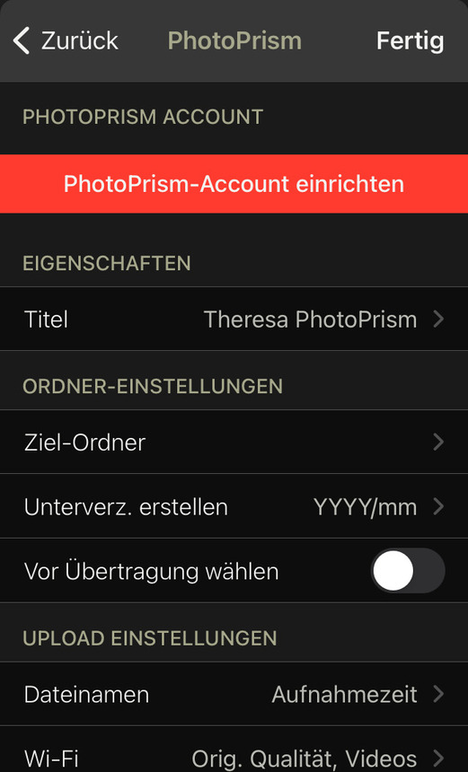
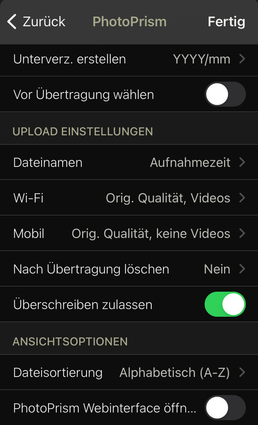
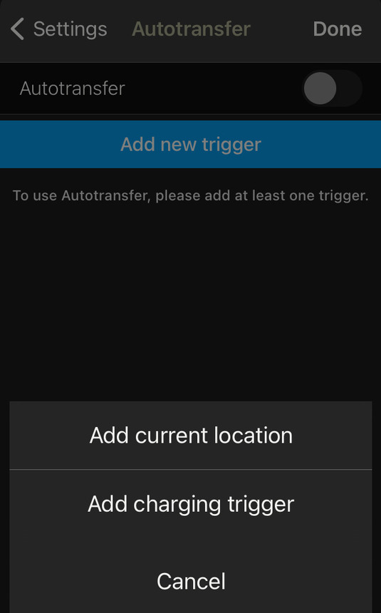

# Syncing with Mobile Devices #

To sync photos and videos on your phone with PhotoPrism, you can use any app that supports WebDAV.

!!! tldr ""
    You can disable WebDAV in the [advanced settings](../settings/advanced.md). Since it requires write permissions and authentication, the built-in WebDAV server is automatically disabled when running in [read-only](../../getting-started/config-options.md#feature-flags) or [public mode](../../getting-started/config-options.md#authentication).

## PhotoSync ##

We recommend [PhotoSync](https://link.photoprism.app/photosync) which is available for Android and iOS.

### Set PhotoPrism or WebDAV as Target ###

!!! attention ""
      If you are using PhotoSync on Android you need to choose WebDAV as target.

1. Open PhotoSync and click :material-cog-outline:
2. Click *Configure*
3. Select PhotoPrism as target

    {: style="width:35%" class="shadow"}
    {: style="width:35%" class="shadow"}

4. Enter your settings

    !!! info ""
        *Server:* Your server url, e.g. "example.photoprism.app".
        
        *Port:* Your port. If you are using HTTPS the port is 443.

        *Login:* Your username, e.g. "admin".
        
        *Password:* Your admin password.

        *Directory:* /import/ or /originals/ depending on your preferred [ingestion method](../library/index.md).
        
        *Use SSL:* Should be enabled.

        [PikaPods](../../getting-started/cloud/pikapods.md) users can find more information [here](https://docs.pikapods.com/apps/photoprism/#sync-from-mobile-apps). 

      {: style="width:35%" class="shadow"}

6. Click *Done*
7. You may adapt transfer details to match your preferences

      {: style="width:35%" class="shadow"}
      {: style="width:35%" class="shadow"}

### Set Up Automatic Sync ###

1. Open PhotoSync and click :material-cog-outline:
2. Click *Autotransfer*

      {: style="width:35%" class="shadow"}

3. Click *Add new trigger* and choose one or more trigger

      {: style="width:35%" class="shadow"}

4. Choose PhotoPrism as target
5. Click *Done*

      {: style="width:35%" class="shadow"}

Because PhotoSync uses WebDAV to send files, PhotoPrism automatically starts importing/indexing when it receives new files.

## Other Apps ##

As long as you run PhotoPrism on a device where it is possible to enable Samba (Windows File Sharing), you can use this free opensource Android app:

[SMBSync2 - Github](https://github.com/Sentaroh/SMBSync2/releases) | [SMBSync2 - Google Play](https://play.google.com/store/apps/details?id=com.sentaroh.android.SMBSync2)
