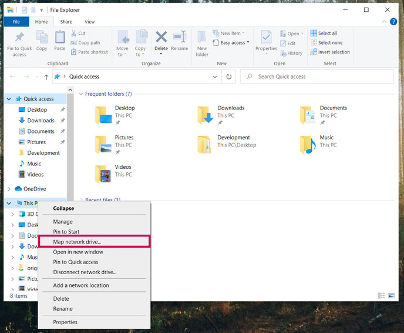
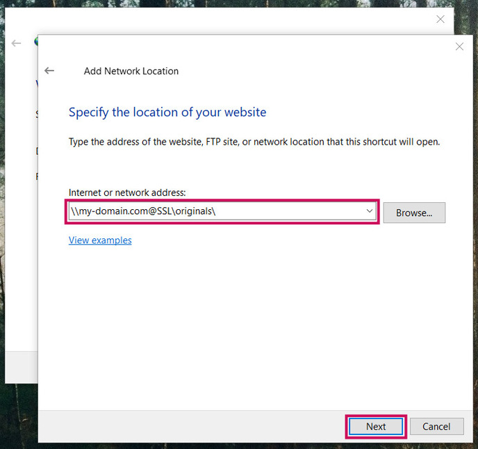
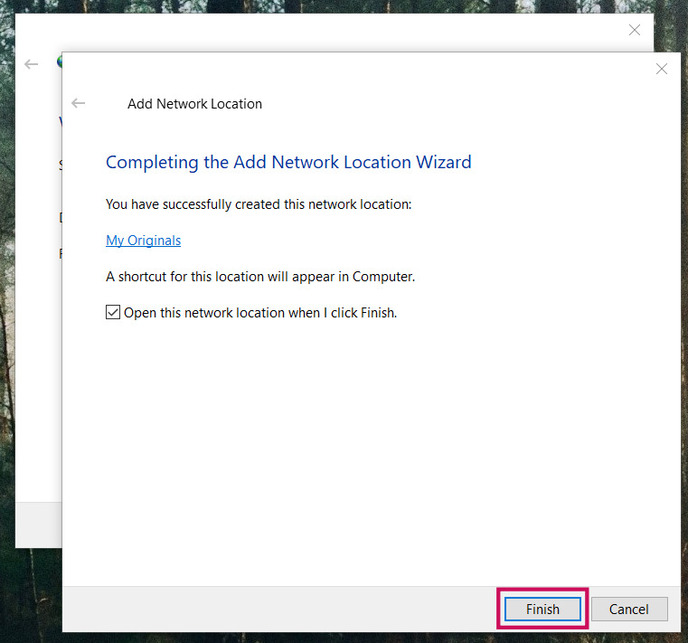
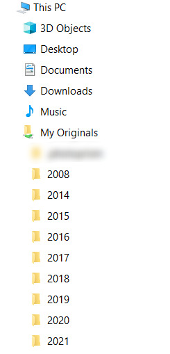

# Connecting via WebDAV #

WebDAV-compatible apps and clients such as [PhotoSync](mobile-devices.md), Microsoft's Windows Explorer,
and Apple's Finder can connect directly to PhotoPrism.

This mounts the *originals* and/or *import* folder as a network drive, allowing you to open, edit, and delete files from a remote device
as if they were local.

After files have been transferred, you can [index](../library/originals.md) or [import](../library/import.md) them as usual.
By default, indexing and importing start automatically after a safety delay when files have been uploaded using WebDAV.

!!! tldr ""
    You can disable WebDAV in the [advanced settings](../settings/advanced.md). Since it requires authentication, the built-in WebDAV server is automatically disabled when running in [public mode](../../getting-started/config-options.md#authentication).


!!! note ""
    It is also possible to [sync files with external WebDAV servers](../settings/sync.md) such as ownCloud or other PhotoPrism instances.

## Server URL ##

The *originals* folder URL for a server exposed to the public Internet is:

```
https://admin@example.com/originals/
```

On Windows, you can enter the following resource in the connection dialog instead:

```
\\example.com@SSL\originals\
```

Please make sure to replace *example.com* with your actual domain and note that the slash at the end is important and cannot be omitted.

!!! tip ""
    You can find your server url on the [account page](../settings/account.md) in settings.

When connecting, you'll have to authenticate using your regular password.
It will also change when you update it in *Settings*. The username is `admin`.

!!! info ""
    You can also connect to the import folder by replacing `originals/` with `import/` in the URL.

For users running their instance locally on the default port *2342*, the *originals* folder URL is:

```
http://admin@localhost:2342/originals/
```

On Windows, you can enter the following resource in the connection dialog instead:

```
\\localhost:2342\originals\
```

The URL or resource to use changes accordingly if you have modified the server hostname, port, or protocol in your configuration.

!!! attention ""
    Never use WebDAV **without HTTPS** outside your local, private network as your
    password would be transmitted, in clear text, over the Internet. Backup tools and file sync apps 
    like [FolderSync](https://foldersync.io/docs/faq/#https-connection-errors)
    may refuse to connect as well.

## Connect to a WebDAV Server ##

=== "macOS"

     1. In the **Finder** on your Mac, choose Go > Connect to Server
     2. Enter the URL as shown above in the **Server Address** field
     3. Click **Connect**

    If you cannot connect to your instance via WebDAV using these instructions:

    - [ ] You do not have sufficient user rights (try as admin)
    - [ ] You are experiencing a [general authentication problem](../../getting-started/troubleshooting/index.md#cannot-log-in)
    - [ ] Your instance or reverse proxy uses an invalid HTTPS certificate
    - [ ] You are trying to connect to the wrong network or server

=== "Windows"

     1. Open Windows **File Explorer**
     2. Right click **This PC**
     3. From the dropdown, select **Map network drive...**

        { class="shadow" }

     4. Enter the drive letter and folder you want to map your WebDAV connection to
     5. Check the boxes **Reconnect at sign-in** and **Connect using different credentials**
     6. Click the **Connect to a Web site that you can use to store your documents and pictures** link
     
        { class="shadow" }
     
     7. Click **Next**
     
        { class="shadow" }
     
     8. Click **Choose a custom network location** and then click **Next**
     
        { class="shadow" }     
     
     9. In the **Internet or network address** field, enter the URL as shown above and click **Next**
        
        { class="shadow" }
     
     10. Enter your username and password and click **Ok**
     
        { class="shadow" }
     
     11. Enter a name for the network location and click **Next**
    
        { class="shadow" }
    
     12. Click **Finish**
    
        { class="shadow" }
    
     The originals folder appears as a mapped drive in Windows Explorer, and you can immediately add,
     edit, or delete files and directories using the Windows File Explorer.
    
     { class="shadow" }

    If you [cannot connect to your instance via WebDAV](../../getting-started/troubleshooting/windows.md#connecting-via-webdav) using these instructions:

    - [ ] You may need to **[change the basic authentication level](../../getting-started/troubleshooting/windows.md#connecting-via-webdav)** in the registry
    - [ ] You do not have sufficient user rights (try as admin)
    - [ ] You are experiencing a [general authentication problem](../../getting-started/troubleshooting/index.md#cannot-log-in)
    - [ ] Your instance or reverse proxy uses an invalid HTTPS certificate
    - [ ] You are trying to connect to the wrong network or server
